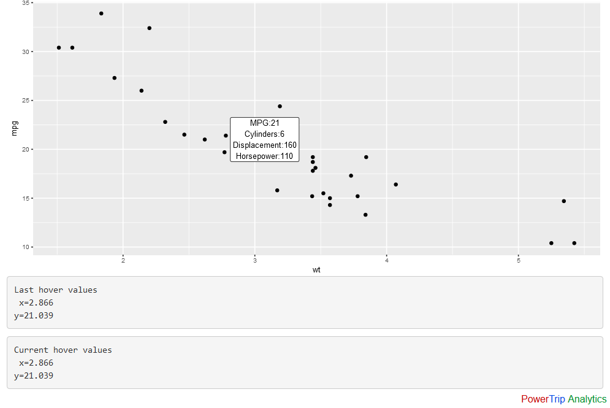

# Shiny, hover labels quickly disappear with ggplot output

Solution requires an initial, non-reactive ggplot object, 
   an initial reactive plot output object,
   and an observeEvent for the hover item, this triggers 
   a graph update with the hover as well as text info dialog updates
     
 2017-01-07 in response to Google Groups thread by Jannik Vindelov 
Response from Stephen McDaniel at PowerTrip Analytics
Program: app.R 
   Data: mtcars

License: MIT License
Attribution, package authors for shiny and ggplot2 on CRAN.
